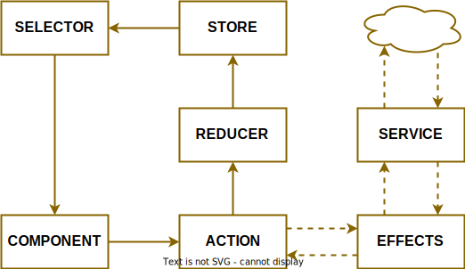

# State Management

The `@mimopo/croqueta` framework includes a simple, fast, and lightweight state management system inspired by [Redux](https://redux.js.org/) and [NgRx](https://ngrx.io/), but built on top of the [TC39 Signals proposal](https://github.com/tc39/proposal-signals).

It manages a single state tree and allows state updates through dispatched actions and reducers. It supports feature-based state registration, side effects, and state selection with signals.

## Fundamental Concepts

The state management system is built around these core concepts:

- **Store**: The single source of truth that holds the application state.
- **Actions**: Plain objects that describe a change in the state.
- **Reducers**: Pure functions that specify how the state changes in response to an action.
- **Selectors**: Functions used to extract and derive specific pieces of state.
- **Features**: Slices of the global state tree, grouped by functionality.
- **Effects**: Side effects that can be used to react to actions, state changes or an external signal.



## Store

The `Store` is a service that can be injected into your components or other services.

```typescript
import { Component, Store, inject } from '@mimopo/croqueta';

class MyComponent extends Component {
  private store = inject(Store);

  protected render(): Node {
    return html`<div></div>`;
  }
}
```

### Dispatching Actions

To update the state, you dispatch an action to the store.

```typescript
this.store.dispatch(myAction({ id: 1 }));
```

### Selecting State

To read state, you use selectors. The `store.select()` method returns a **Computed Signal**, which automatically updates when the state changes.

```typescript
const count = this.store.select(selectCount);

// In a component effect or template
console.log(count.get());
```

## Actions

Actions are created using the `createAction` helper. This ensures consistency and simplifies typing (although in JavaScript, it's mostly for organization).

```typescript
import { createAction } from '@mimopo/croqueta';

// Action with no payload
const increment = createAction<void>('INCREMENT');

// Action with a payload
const addUser = createAction<{ name: string }>('ADD_USER');

// Using the actions
const action = addUser({ name: 'John' });
// returns { type: 'ADD_USER', payload: { name: 'John' } }
```

## Reducers

Reducers are functions that take the current state and an action payload, and return a new state object. They must be pure functions.

```typescript
import type { Reducer } from '@mimopo/croqueta';

const counterReducer: Reducer<{ count: number }, void> = (state) => {
  return {
    ...state,
    count: state.count + 1,
  };
};

const userReducer: Reducer<{ users: string[] }, string> = (state, payload) => {
  return {
    ...state,
    users: [...state.users, payload],
  };
};
```

## Selectors

Selectors are functions that extract a piece of state from the global state tree.

### Feature Selectors

Use `createFeatureSelector` to get a top-level slice of the state.

```typescript
import { createFeatureSelector } from '@mimopo/croqueta';

const selectCounterState = createFeatureSelector<{ count: number }>('counter');
```

### Derived Selectors

Use `createSelector` to create complex state derivations. These are memoized for performance.

```typescript
import { createSelector } from '@mimopo/croqueta';

const selectCount = createSelector(selectCounterState, (state) => state.count);

const selectIsPositive = createSelector(selectCount, (count) => count > 0);
```

## Features

Features allow you to group your state, actions, and reducers into logical slices. This is the recommended way to organize state in your application.

Use `createFeature` to define a feature and `store.registerFeature()` to add it to the global store.

### Defining a Feature

```typescript
import { createFeature, createAction, createFeatureSelector, createSelector, type Reducers } from '@mimopo/croqueta';

const key = 'counter';
const initialState = { count: 0 };

const actions = {
  increment: createAction<void>('increment'),
  decrement: createAction<void>('decrement'),
};

const reducers: Reducers<typeof initialState, typeof actions> = {
  increment: (state) => ({ ...state, count: state.count + 1 }),
  decrement: (state) => ({ ...state, count: state.count - 1 }),
};

const featureSelector = createFeatureSelector<typeof initialState>(key);
const selectors = {
  count: createSelector(featureSelector, (state) => state.count),
};

export const counterFeature = createFeature({
  key,
  initialState,
  actions,
  reducers,
  selectors,
});
```

### Registering a Feature

Features are usually registered at the application level or within a specific service.

```typescript
import { Store, inject } from '@mimopo/croqueta';
import { counterFeature } from './counter.feature';

const store = inject(Store);
store.registerFeature(counterFeature);
```

## Effects

Effects handle side effects like data fetching or complex workflows. An effect is a function that receives the `Store` instance and can optionally return an action to be dispatched.

Effects are reactive; they run inside a signal effect and can react to state or action changes.

```typescript
import { type Effect, Store } from '@mimopo/croqueta';

const loadUsersEffect: Effect = async (store: Store) => {
  // We can react to an action being dispatched
  const lastAction = store.actions.get();

  if (lastAction.type === 'LOAD_USERS') {
    const response = await fetch('/api/users');
    const users = await response.json();

    // Return an action to update the state
    return usersLoadedAction(users);
  }
};

// Registering the effect
store.registerEffect(loadUsersEffect);
```

You can also pass effects directly in the feature configuration:

```typescript
export const usersFeature = createFeature({
  // ...
  effects: [loadUsersEffect],
});
```

## Examples

For a complete working example of the state management in action, check out the [State Example Application](../../../../examples/state?github).

You can open it directly with
[StackBlitz ⚡️](https://stackblitz.com/github/mimopo/croqueta/tree/main?file=examples/state/src/main.ts&startScript=examples-state)
